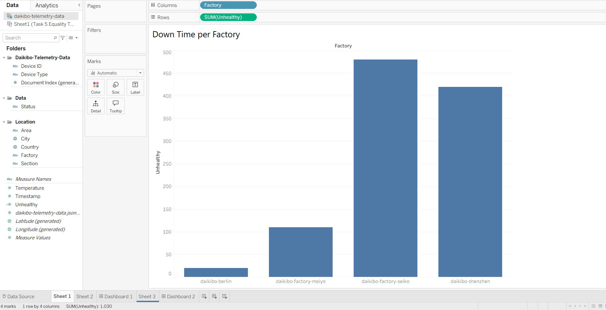
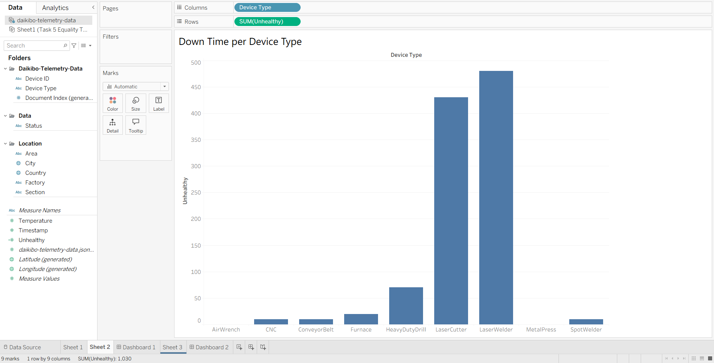
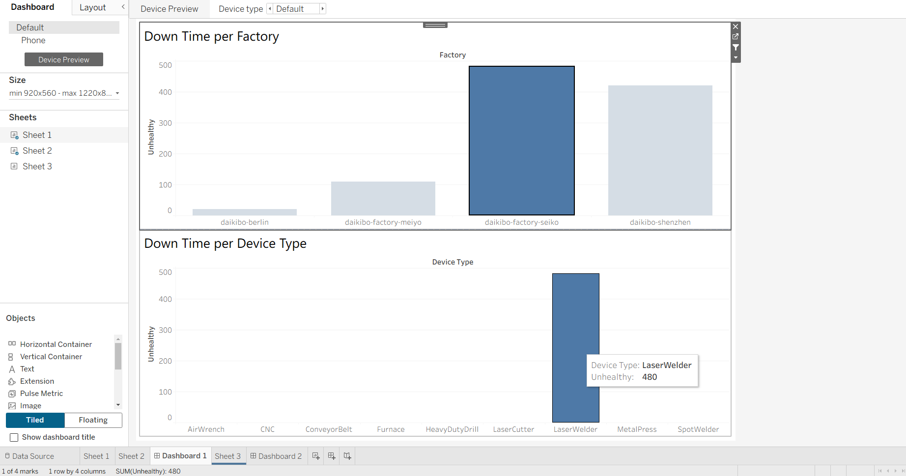
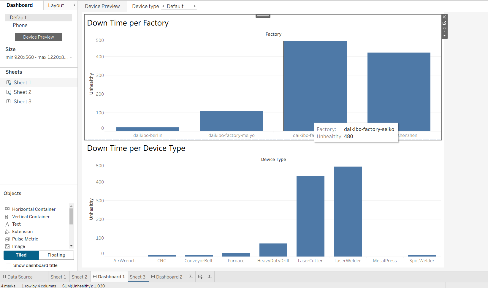
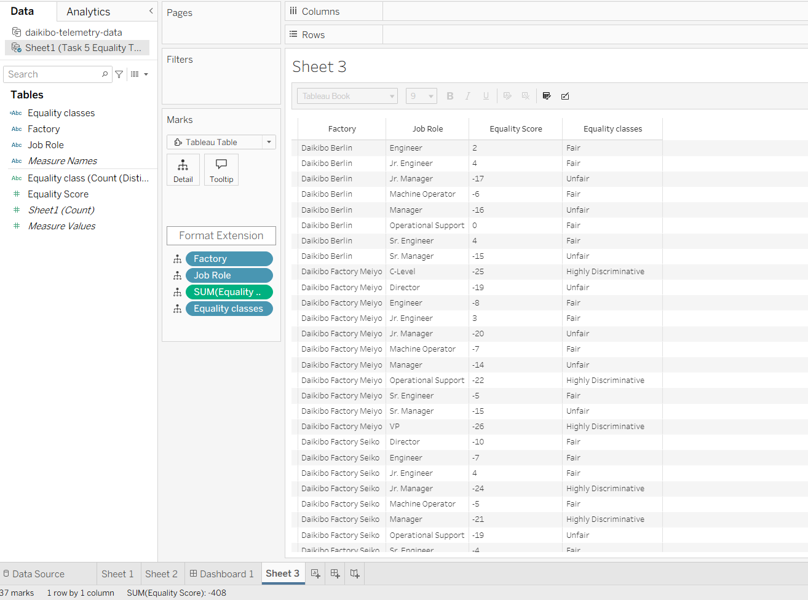
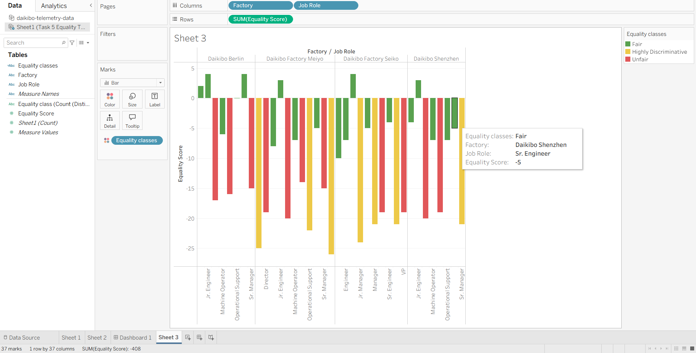

# 🏭 Deloitte Australia — Data Analytics Job Simulation
> Completed via [Forage](https://www.theforage.com/) | March 2026

---

## 📌 Overview

This repository contains my work from the **Deloitte Australia Data Analytics 
Job Simulation** hosted on Forage. The simulation replicates real tasks performed 
by analysts at Deloitte's Forensic Technology team — involving data classification, 
business intelligence dashboarding, and drawing actionable conclusions from 
operational data.

---

## 🏢 About the Simulation

**Company:** Deloitte Australia  
**Track:** Data Analytics & Forensic Technology  
**Platform:** Forage  
**Completed:** March 29, 2026  

---

## 🎯 Tasks Completed

### ✅ Task 1 — Tableau Dashboard Development

Built an interactive Tableau dashboard analyzing operational data 
across **4 Daikibo factories**:
- Daikibo Berlin
- Daikibo Factory Meiyo
- Daikibo Factory Seiko
- Daikibo Shenzhen
  
---

### ✅ Task 2 — Data Classification in Excel
- Worked with an employee compensation dataset containing:
  - `Factory` — manufacturing site name
  - `Job Role` — employee role/designation
  - `Equality Score` — integer score ranging from -100 to +100
    
- Added a calculated **4th column: Equality Class** using the formula:
```excel
=IF(ABS(C2)<=10,"Fair",IF(ABS(C2)<=20,"Unfair","Highly Discriminative"))
```


| Equality Class       | Score Range                        |
|----------------------|------------------------------------|
| ✅ Fair              | -10 ≤ score ≤ +10                 |
| ⚠️ Unfair            | +-20 ≤ score ≤ +-11               |
| 🚨 Highly Discriminative | score < -20 or score > +20    |

---

#### 📊 Visual 1 — Down Time per Factory
- Identified Daikibo Factory Seiko as the highest downtime factory (480 Unhealthy units)

#### 📊 Visual 2 — Down Time per Device Type
- LaserWelder recorded the highest downtime across all device types

#### 🚀 Bonus Task — Equality Score Visualization (Self-Initiated)
-> This was not part of the required tasks — built independently 
-> to deepen understanding of the dataset.

- Bar chart colored by Equality Class (🟢 Fair / 🟡 Highly Discriminative / 🔴 Unfair)
- Enables quick identification of discriminatory compensation 
  patterns per factory and role
- Added a calculated 4th column : Equality Class using the formula:
```tableau
IF ABS([Equality Score]) <= 10 THEN "Fair"
ELSEIF ABS([Equality Score]) <= 20 THEN "Unfair"
ELSE "Highly Discriminative"
END
```

---


## 🔍 Key Business Insights

1. **Daikibo Factory Meiyo** has the most "Highly Discriminative" roles 
   — C-Level, Operational Support, and VP show scores beyond ±20
   
3. **Daikibo Factory Seiko** has the highest equipment downtime 
   — a potential link between poor working conditions and compensation inequality
   
5. **LaserWelder** devices are the most failure-prone — 
   recommended priority for preventive maintenance scheduling
   
7. **Daikibo Berlin** has the most "Fair" compensation scores 
   — can serve as the internal benchmark for other factories

---

## 🛠️ Tools & Skills Used

| Tool          | Usage                                      |
|---------------|--------------------------------------------|
| Excel         | Data classification, IF formula logic      |
| Tableau       | Dashboard creation, calculated fields      |
| Data Analysis | Pattern recognition, business insights     |

---

## 📸 Screenshots

### Dashboard — Down Time per Factory


### Dashboard — Down Time per Device Type


### Dashboard — Down Time Analysis



### Equality Classification Table


### Equality Score Bar Chart (by Factory & Job Role)


---

## 🏅 Certificate

**Issued by:** Deloitte Australia via Forage — March 29, 2026  
🔗 [View verified certificate on LinkedIn](https://www.linkedin.com/posts/manjunathareddyn_forage-data-analytics-certificate-ugcPost-7443937453276758016-JoA2)

