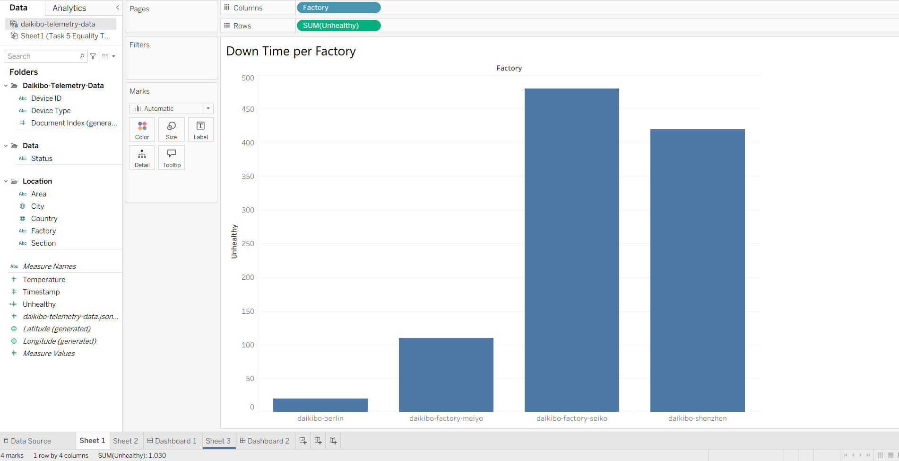
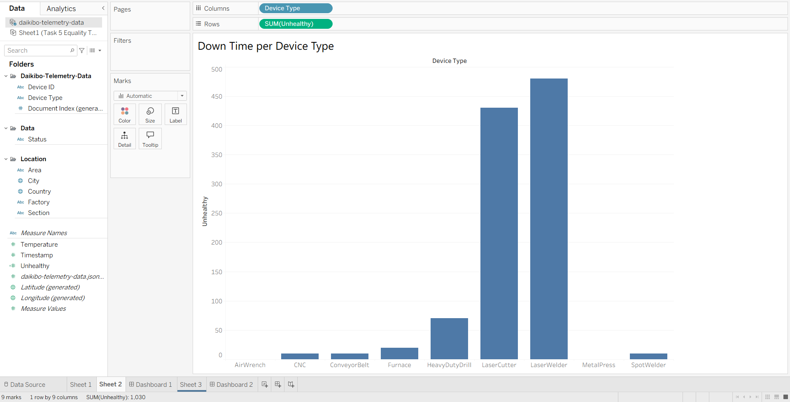
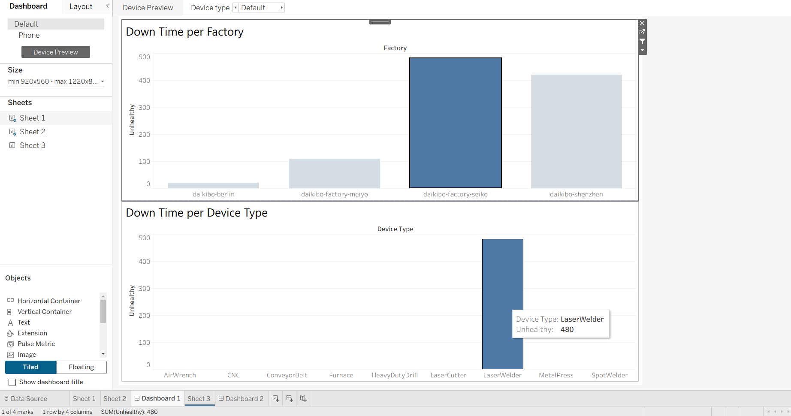
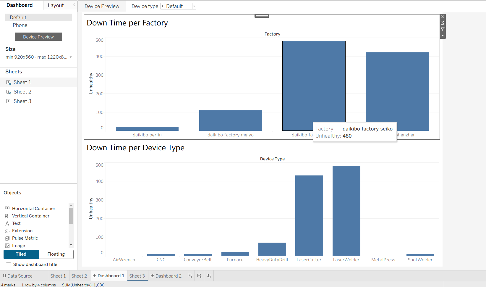
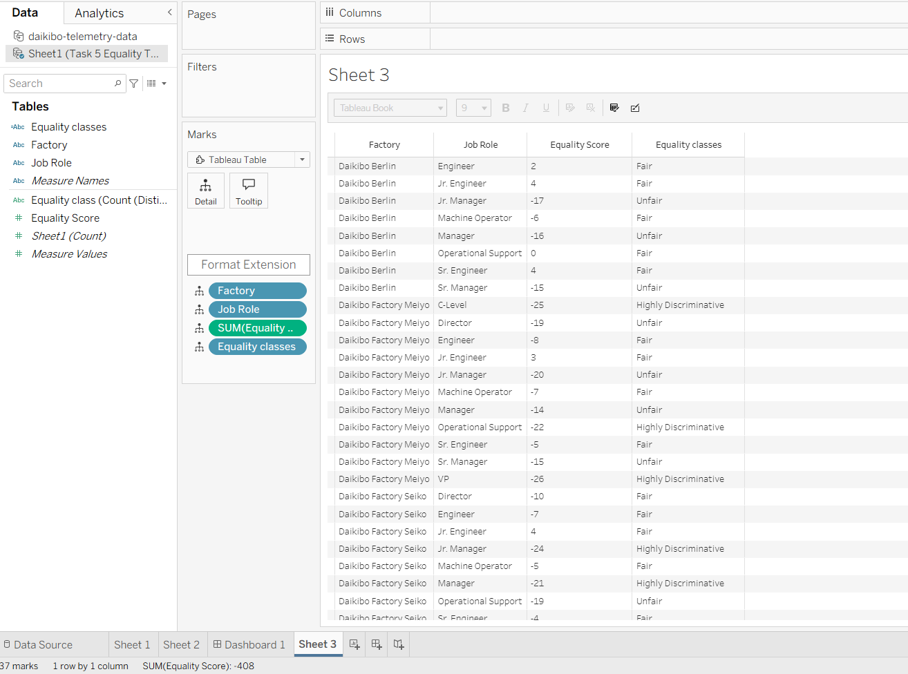
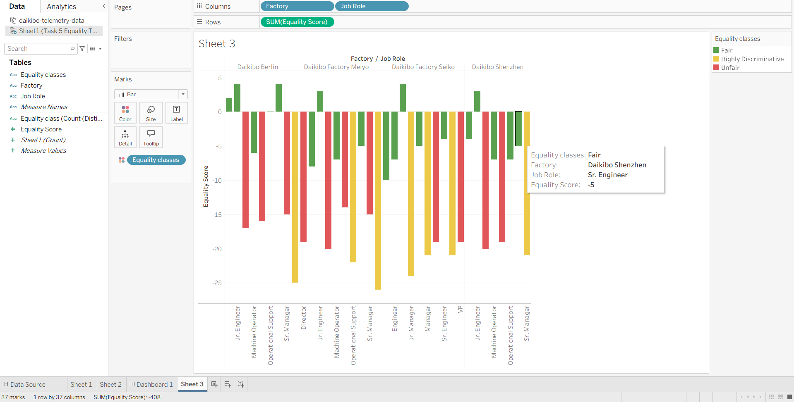

<div align="center">
<h1>🏭 Deloitte Australia — Data Analytics Job Simulation</h1>
 
<p><strong>Forensic Technology · Business Intelligence · Data Classification</strong></p>
<p>
  
  
  
  
  
</p>
<p>
  
  
  
</p>
</div>

---
 
## 📌 Overview
 
This repository documents my completion of the **Deloitte Australia Data Analytics & Forensic Technology Job Simulation** on [The Forage](https://www.theforage.com/). The simulation replicates real analyst work performed inside Deloitte's Forensic Technology practice — analyzing operational telemetry data, building executive dashboards, and classifying HR compensation data to surface pay equity risks.
 
The client: **Daikibo Industrials**, a global machinery manufacturer operating 4 factories across Germany, Japan, and China.
 
---
 
## 🗂️ Table of Contents
 
- [Simulation Summary](#-simulation-summary)
- [Tasks Completed](#-tasks-completed)
- [Key Business Insights](#-key-business-insights)
- [Tools & Skills Used](#️-tools--skills-used)
- [Repository Structure](#-repository-structure)
- [Business Problems Solved](#-business-problems-solved)
- [Simulation-to-Real-World Mapping](#-simulation-to-real-world-mapping)
- [What I Would Do Differently](#-what-i-would-do-differently)
- [Screenshots](#-screenshots)
- [Connect](#-connect)
  
---
 
## 📋 Simulation Summary
 
| Field | Details |
|---|---|
| **Company** | Deloitte Australia |
| **Practice** | Forensic Technology & Data Analytics |
| **Platform** | The Forage |
| **Duration** | 1–2 hours (self-paced) |
| **Completed** | March 29, 2026 |
| **Tasks** | 2 required + 1 self-initiated bonus |
| **Deliverables** | Tableau Dashboard · Excel Classification Table · Bonus Equality Viz |
 
---

## 🎯 Tasks Completed

### ✅ Task 1 — Tableau Dashboard Development

Built an interactive Tableau dashboard analyzing operational data 
across **4 Daikibo factories**:
- Daikibo Berlin
- Daikibo Factory Meiyo
- Daikibo Factory Seiko
- Daikibo Shenzhen
  
---

### ✅ Task 2 — Data Classification in Excel
- Worked with an employee compensation dataset containing:
  - `Factory` — manufacturing site name
  - `Job Role` — employee role/designation
  - `Equality Score` — integer score ranging from -100 to +100
    
- Added a calculated **4th column: Equality Class** using the formula:
```excel
=IF(ABS(C2)<=10,"Fair",IF(ABS(C2)<=20,"Unfair","Highly Discriminative"))
```


| Equality Class       | Score Range                        |
|----------------------|------------------------------------|
| ✅ Fair              | -10 ≤ score ≤ +10                 |
| ⚠️ Unfair            | +-20 ≤ score ≤ +-11               |
| 🚨 Highly Discriminative | score < -20 or score > +20    |

---

#### 📊 Visual 1 — Down Time per Factory
- Identified Daikibo Factory Seiko as the highest downtime factory (480 Unhealthy units)

#### 📊 Visual 2 — Down Time per Device Type
- LaserWelder recorded the highest downtime across all device types

#### 🚀 Bonus Task — Equality Score Visualization (Self-Initiated)
-> This was not part of the required tasks — built independently 
-> to deepen understanding of the dataset.

- Bar chart colored by Equality Class (🟢 Fair / 🟡 Highly Discriminative / 🔴 Unfair)
- Enables quick identification of discriminatory compensation 
  patterns per factory and role
- Added a calculated 4th column : Equality Class using the formula:
```tableau
IF ABS([Equality Score]) <= 10 THEN "Fair"
ELSEIF ABS([Equality Score]) <= 20 THEN "Unfair"
ELSE "Highly Discriminative"
END
```

---

## 🔍 Key Business Insights

1. **Daikibo Factory Meiyo** has the most "Highly Discriminative" roles 
   — C-Level, Operational Support, and VP show scores beyond ±20
   
3. **Daikibo Factory Seiko** has the highest equipment downtime 
   — a potential link between poor working conditions and compensation inequality
   
5. **LaserWelder** devices are the most failure-prone — 
   recommended priority for preventive maintenance scheduling
   
7. **Daikibo Berlin** has the most "Fair" compensation scores 
   — can serve as the internal benchmark for other factories

---

## 🛠️ Tools & Skills Used

| Tool          | Usage                                      |
|---------------|--------------------------------------------|
| Excel         | Data classification, IF formula logic      |
| Tableau       | Dashboard creation, calculated fields      |
| Data Analysis | Pattern recognition, business insights     |

---

## 📁 Repository Structure
 
```plaintext
Deloitte---Data-Analytics-Job-Simulation/
├── screenshots/
│   ├── Screenshot-sheet1.png          ← Downtime per Factory (Tableau)
│   ├── Screenshot-sheet2.png          ← Downtime per Device Type (Tableau)
│   ├── Screenshot-downtime_db.png     ← Combined Dashboard view
│   ├── Screenshot-downtime.png        ← Downtime detail view
│   ├── Screenshot-excel_table.png     ← Equality Classification Table
│   └── Screenshot-excel_db.png        ← Equality Score Bar Chart (Bonus)
├── tableau/
│   └── [Tableau workbook files]
├── README.md
└── .gitattributes
```
 
---
 
## 🧩 Business Problems Solved
 
| # | Problem | Approach | Outcome |
|---|---|---|---|
| 1 | Which factory needs urgent maintenance? | Aggregated Unhealthy readings by factory in Tableau | Seiko identified as highest-risk (480 units) |
| 2 | Which machine type breaks down most? | Device-level downtime breakdown chart | LaserWelder flagged for preventive programme |
| 3 | Where are pay equality risks highest? | Excel IF-ABS classification on equality scores | Meiyo identified as highest-risk factory for pay discrimination |
| 4 | How do equality gaps vary across roles and factories? | Self-initiated cross-dimensional Tableau viz | Visual pattern confirmed Meiyo's C-Level and VP roles as critical |
 
---
 
## 🔄 Simulation-to-Real-World Mapping
 
| Simulation Task | Real Deloitte Analyst Equivalent |
|---|---|
| Importing JSON telemetry into Tableau | Connecting to client operational data pipelines for forensic audit |
| Building downtime dashboard | Delivering BI dashboards to ops leadership for decision support |
| Classifying equality scores in Excel | Running forensic compensation audits for HR legal compliance reviews |
| Self-initiated bonus visualization | Going beyond the brief — a core expectation at senior analyst level |
| Generating business insights | Writing findings memos and recommendations for client sign-off |
 
---
 
## 🔁 What I Would Do Differently
 
- **Add a time-series dimension** — the telemetry data likely contains timestamps; plotting downtime trends over time would reveal whether issues are worsening or cyclical.
- **Build a drill-down filter** in the Tableau dashboard so stakeholders could toggle by factory without switching sheets.
- **Add conditional formatting** in Excel (red/amber/green fill) alongside the Equality Class column to make risk tiers instantly scannable.
- **Write a short findings memo** — a 1-page summary of recommendations is typically the final deliverable for a forensic engagement, not just the data artefact itself.
  
---

## 📸 Screenshots

### Dashboard — Down Time per Factory


### Dashboard — Down Time per Device Type


### Dashboard — Down Time Analysis



### Equality Classification Table


### Equality Score Bar Chart (by Factory & Job Role)


---

## Connect

<p>
  <a href="https://www.linkedin.com/in/manjunathareddyn/">
    
  </a>
  &nbsp;
  <a href="https://github.com/MrBeastGamerZz">
    
  </a>
</p>

---
 
<div align="center">
<p>Deloitte Australia via Forage — March,2026</p>
<sub>Completed as part of a self-directed effort to gain real-world professional exposure before entering the workforce. All work, insights, and visualizations are my own.</sub>
</div>

